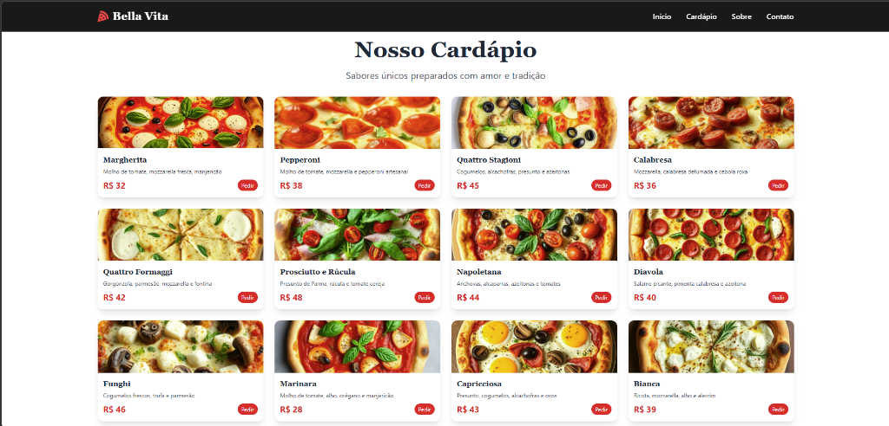
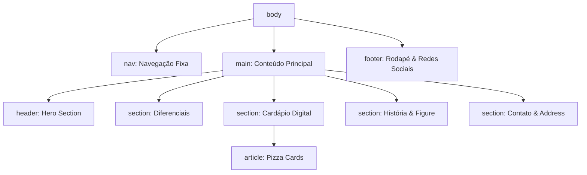

# 🍕 Pizzaria Bella Vita - Sabor Autêntico Italiano

## 📋 Sobre o Projeto
A **Pizzaria Bella Vita** é um website institucional e cardápio digital moderno, desenvolvido com foco em performance, acessibilidade e SEO. O projeto traz a experiência da autêntica culinária italiana para a web, utilizando práticas avançadas de desenvolvimento frontend.

A aplicação foi submetida a uma refatoração profunda para garantir conformidade com os padrões **W3C**, **WCAG (Acessibilidade)** e **melhores práticas de SEO orgânico**.

---

## 🎯 Funcionalidades
- **Cardápio Digital:** Visualização completa dos sabores com preços e descrições.
- **Navegação Inteligente:** Menu fixo com scroll suave para seções específicas.
- **Design Responsivo:** Adaptado perfeitamente para dispositivos móveis, tablets e desktops.
- **Interatividade:** Menu mobile toggle e feedback visual em botões de pedido.
- **Micro-animações:** Efeitos de fade-in e parallax para uma experiência premium.

---

## 🏗️ Estrutura Técnica e Refatoração
O projeto foi estruturado utilizando **HTML5 Semântico**, **Tailwind CSS** para estilização eficiente e **JavaScript Vanilla (ES6+)** para lógica de interface.

### 🛠️ Melhorias Implementadas:
- **Semântica 100%:** Substituição de `divs` genéricas por tags como `<main>`, `<article>`, `<section>`, `<header>`, `<footer>`, `<ul>` e `<figure>`.
- **Acessibilidade (ARIA):** Implementação de `aria-label`, `role`, e estados dinâmicos como `aria-expanded` para leitores de tela.
- **SEO Orgânico:** Estrutura de títulos (H1-H3) otimizada e uso de tags que favorecem a indexação por mecanismos de busca.
- **Performance:** Uso de ativos locais e carregamento eficiente de fontes (Google Fonts).

---

## 📊 Arquitetura da Página
O fluxo de informações e a hierarquia do DOM seguem este padrão:

---

## 🚀 Como Executar
1. Clone este repositório.
2. Certifique-se de ter as imagens na pasta `img/`.
3. Utilize uma extensão como **Live Server** (VS Code) ou qualquer servidor HTTP simples para rodar o arquivo `index.html`.
4. Devido ao uso de recursos modernos e carregamento de fontes externas, recomenda-se conexão com a internet para a primeira carga.

---

## 📄 Licença
Este projeto é para fins de demonstração de práticas de desenvolvimento web moderno.

---
*Desenvolvido com ❤️ por SandecoClaw*
